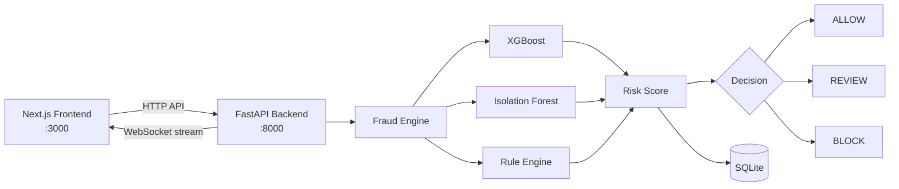
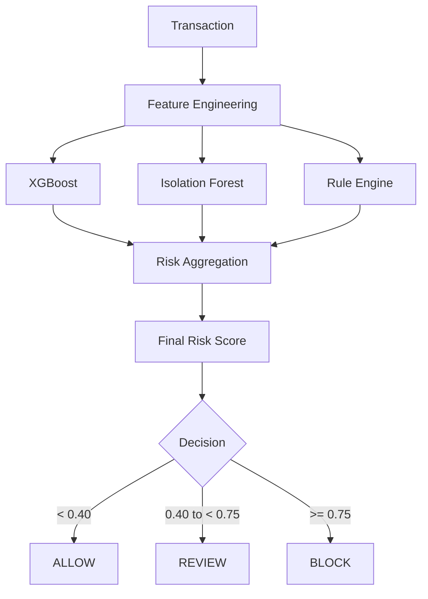

# 🛡️ UFDE: Unified Fraud Detection Engine

A real-time fraud detection and transaction monitoring system built with **FastAPI, Next.js, machine learning, SQLite and Docker**.

UFDE scores every transaction from 0 to 1 using three detection layers (XGBoost, Isolation Forest and a rule engine), classifies it as `ALLOW`, `REVIEW` or `BLOCK`, and streams the result to a live fraud-monitoring dashboard.

---

## Table of Contents

- [Features](#-features)
- [Architecture](#%EF%B8%8F-architecture)
- [Tech Stack](#%EF%B8%8F-tech-stack)
- [Project Structure](#-project-structure)
- [Quick Start (Docker)](#-quick-start-docker)
- [Fraud Detection Pipeline](#-fraud-detection-pipeline)
- [API Reference](#-api-reference)
- [Real-Time Streaming](#-real-time-streaming)
- [Simulator and Fraud Scenarios](#-simulator-and-fraud-scenarios)
- [Database](#%EF%B8%8F-database)
- [Local Development](#-local-development)
- [Model Training](#-model-training)
- [Environment Variables](#-environment-variables)
- [Testing](#-testing)
- [Repository Hygiene](#-repository-hygiene)
- [Limitations](#%EF%B8%8F-limitations)
- [Future Improvements](#-future-improvements)
- [Author](#-author)

---

## 🚀 Features

**Detection**
- Real-time transaction scoring with a fraud risk score from 0 to 1
- Decisions: `ALLOW`, `REVIEW`, `BLOCK`
- Hybrid detection: XGBoost (supervised), Isolation Forest (anomaly) and a rule engine
- Explainable results: every flagged transaction carries human-readable reasons

**Monitoring dashboard**
- Live transaction stream over WebSockets
- Filtering by channel and by flagged transactions
- Alert queue with actions: **Confirm fraud**, **False positive**, **Escalate**
- Account/entity timeline across channels
- Metrics: totals, flag rate, open alerts, average latency, channel distribution

**Platform**
- Built-in transaction simulator with injectable fraud scenarios
- SQLite persistence
- Fully Dockerized frontend and backend, started with one command

---

## 🏗️ Architecture



---

## 🛠️ Tech Stack

| Layer | Technologies |
|---|---|
| **Frontend** | Next.js, React, TypeScript, Tailwind CSS, Recharts, Lucide React |
| **Backend** | Python 3.11, FastAPI, Uvicorn, SQLModel, SQLite, WebSockets |
| **Machine Learning** | scikit-learn, XGBoost, NumPy, Pandas, SHAP, Joblib |
| **DevOps** | Docker, Docker Compose |

---

## 📁 Project Structure

```text
UFDE_Project/
├── backend/
│   ├── app/
│   │   ├── api/
│   │   │   └── routes.py
│   │   ├── services/
│   │   │   ├── features.py
│   │   │   ├── pipeline.py
│   │   │   ├── scorer.py
│   │   │   └── store.py
│   │   ├── config.py
│   │   ├── db.py
│   │   ├── main.py
│   │   ├── schemas.py
│   │   ├── state.py
│   │   └── ws.py
│   ├── ml/
│   │   ├── artifacts/
│   │   │   └── model.joblib
│   │   └── train.py
│   ├── simulator/
│   │   └── generator.py
│   ├── tests/
│   ├── Dockerfile
│   ├── requirements.txt
│   └── pytest.ini
├── frontend/
│   ├── app/
│   ├── components/
│   ├── lib/
│   ├── Dockerfile
│   ├── package.json
│   └── package-lock.json
├── docker-compose.yml
├── .gitignore
└── README.md
```

---

## ⚡ Quick Start (Docker)

Docker Compose is the recommended way to run the complete application. You do **not** need to install Python packages or Node dependencies manually.

### Requirements

- [Docker Desktop](https://www.docker.com/products/docker-desktop/)
- Git

### 1. Clone the repository

```bash
git clone https://github.com/sankalp-st/UFDE-Unified-Fraud-Detection-Engine.git
cd UFDE-Unified-Fraud-Detection-Engine
```

### 2. Start the application

```bash
docker compose up --build
```

Compose builds both images, installs dependencies, starts the backend and frontend, creates the SQLite volume, and starts the WebSocket server.

> **Note:** the backend image copies `backend/ml/artifacts/model.joblib`. If you cloned a copy without it, [train the model](#-model-training) first.

### 3. Open the application

| Service | URL |
|---|---|
| Dashboard | http://localhost:3000 |
| Backend API | http://localhost:8000 |
| Swagger docs | http://localhost:8000/docs |
| Health check | http://localhost:8000/health |

### 4. Try it

1. On the dashboard, press **Start** in the Simulator panel.
2. Press one of the **⚡ Inject fraud scenario** buttons.
3. Click the flagged row to see the risk score, detector breakdown and reasons.

### Docker services

| Service | Container | Port | Runs |
|---|---|---|---|
| Backend | `ufde_project-backend-1` | 8000 | FastAPI, Uvicorn, ML models, SQLite, WebSocket server |
| Frontend | `ufde_project-frontend-1` | 3000 | Next.js, React, TypeScript |

---

## 🧠 Fraud Detection Pipeline



### Detectors

| Detector | Type | What it catches |
|---|---|---|
| **XGBoost** | Supervised | Learned fraud patterns from transaction features |
| **Isolation Forest** | Unsupervised | Unusual transactions and novel anomalies |
| **Rule Engine** | Deterministic | Velocity bursts, unseen devices, impossible travel, cross-channel activity, shared beneficiaries and devices |

### Scoring configuration

| Setting | Value |
|---|---|
| XGBoost weight | 0.60 |
| Isolation Forest weight | 0.25 |
| Rule engine weight | 0.15 |
| `ALLOW` | risk < 0.40 |
| `REVIEW` | 0.40 ≤ risk < 0.75 |
| `BLOCK` | risk ≥ 0.75 |

The final score is the weighted blend of the three detectors, and a confident individual detector (the rule engine or XGBoost) can escalate the score on its own, so a rule-only fraud such as a velocity burst is not diluted by the other models.

---

## 🔌 API Reference

**Base URL:** `http://localhost:8000/api/v1`

| Method | Endpoint | Description |
|---|---|---|
| `POST` | `/score` | Score a transaction |
| `GET` | `/transactions` | List transactions (filters: `channel`, `decision`, `limit`) |
| `GET` | `/alerts` | List alerts (`?status=open`) |
| `PATCH` | `/alerts/{alert_id}` | Take action on an alert |
| `GET` | `/entities/{account_id}` | Transaction history and entity information |
| `GET` | `/metrics` | System metrics |
| `POST` | `/reset` | Reset stored transactions, alerts and feedback |
| `POST` | `/simulate/start` | Start the simulator |
| `POST` | `/simulate/stop` | Stop the simulator |
| `POST` | `/simulate/inject/{scenario}` | Inject a fraud scenario |
| `WS` | `/ws/stream` | Live scored-transaction stream (`ws://localhost:8000/ws/stream`) |

### Score a transaction

`POST /api/v1/score`

```json
{
  "account_id": "ACC1001",
  "channel": "UPI",
  "txn_type": "PAYMENT",
  "amount": 450.0,
  "old_balance_orig": 5000.0,
  "new_balance_orig": 4550.0,
  "old_balance_dest": 1000.0,
  "new_balance_dest": 1450.0,
  "beneficiary_id": "BEN1001",
  "device_id": "DEV1001",
  "ip": "192.168.1.10",
  "lat": 12.9716,
  "lon": 77.5946
}
```

| Field | Allowed values |
|---|---|
| `channel` | `UPI`, `CARD`, `NETBANKING`, `ATM` |
| `txn_type` | `PAYMENT`, `TRANSFER`, `CASH_OUT`, `CASH_IN`, `DEBIT` |

Example response:

```json
{
  "txn_id": "a1b2c3d4e5f6",
  "risk_score": 0.03,
  "decision": "ALLOW",
  "reasons": [],
  "latency_ms": 12.4,
  "model_scores": { "xgb": 0.0, "iso": 0.12, "rules": 0.0 }
}
```

### Get transactions

```http
GET /api/v1/transactions?limit=100&channel=UPI&decision=BLOCK
```

### Get alerts and act on them

```http
GET /api/v1/alerts?status=open
```

`status` is one of `open`, `confirmed`, `dismissed`, `escalated`.

```http
PATCH /api/v1/alerts/{alert_id}
```

```json
{ "action": "confirm_fraud" }
```

Actions: `confirm_fraud`, `false_positive`, `escalate`.

### Metrics

`GET /metrics` returns total transactions, flagged transactions, flag rate, open alerts, average latency and the per-channel distribution.

### Simulator

```http
POST /api/v1/simulate/start
```

```json
{ "rate": 3, "fraud_rate": 0.05 }
```

`rate` is transactions per second; `fraud_rate` is the share of ticks that inject a fraud scenario.

---

## 🔴 Real-Time Streaming

UFDE streams every scored transaction to the dashboard over a WebSocket, so the UI updates without polling or page refreshes.

```text
ws://localhost:8000/ws/stream
```

Each message contains the transaction fields plus `risk_score`, `decision`, `reasons`, `latency_ms`, `model_scores` and `alert_id` (set when the transaction raised an alert).

---

## 🎮 Simulator and Fraud Scenarios

The simulator generates realistic multi-channel traffic and can inject specific fraud patterns on demand:

```http
POST /api/v1/simulate/inject/{scenario}
```

| Scenario | Pattern |
|---|---|
| `ato` | **Account takeover**: unseen device, account drained to a new beneficiary |
| `velocity` | **Velocity burst**: many small payments within seconds |
| `cross_channel` | **Cross-channel cash-out**: card → UPI → ATM in quick succession |
| `travel` | **Impossible travel**: two distant cities within seconds |
| `mule_ring` | **Mule ring**: several accounts paying the same beneficiary |

---

## 🗄️ Database

UFDE persists data in SQLite. Inside Docker the database lives at `/data/ufde.db`, on a named volume called `ufde-data`, so it survives container re-creation.

| Command | Effect |
|---|---|
| `docker compose down` | Stop the app, **keep** the database |
| `docker compose down -v` | Stop the app and **delete** the database volume |

> ⚠️ `docker compose down -v` permanently deletes the volume containing the SQLite database.

---

## 💻 Local Development

Docker is recommended, but each part can also run directly.

### Backend

```bash
cd backend
python -m venv .venv
```

Activate the virtual environment:

```powershell
# Windows PowerShell
.\.venv\Scripts\Activate.ps1
```
```bash
# macOS / Linux
source .venv/bin/activate
```

Install and run:

```bash
pip install -r requirements.txt
python -m uvicorn app.main:app --reload --port 8000
```

### Frontend

```bash
cd frontend
npm install
```

Create `frontend/.env.local`:

```bash
NEXT_PUBLIC_API=http://localhost:8000
NEXT_PUBLIC_WS=ws://localhost:8000/ws/stream
```

```bash
npm run dev
```

Open http://localhost:3000.

---

## 📊 Model Training

The training dataset is **not** stored in Git because the raw file is very large (~470 MB). Download the **PaySim** dataset from Kaggle and place it at:

```text
backend/data/paysim.csv
```

From the `backend` directory:

```bash
# macOS / Linux
python -m ml.train data/paysim.csv
```
```powershell
# Windows
python -m ml.train data\paysim.csv
```

The trained model is saved to `backend/ml/artifacts/model.joblib`. The script prints PR-AUC for both models, recall at 90% precision and a confusion matrix.

---

## 🔐 Environment Variables

| Variable | Used by | Default / Docker value |
|---|---|---|
| `DB_URL` | Backend | `sqlite:///ufde.db` (Docker: `sqlite:////data/ufde.db`) |
| `ALLOWED_ORIGINS` | Backend | `http://localhost:3000` (comma-separated list) |
| `NEXT_PUBLIC_API` | Frontend | `http://localhost:8000` |
| `NEXT_PUBLIC_WS` | Frontend | `ws://localhost:8000/ws/stream` |

> `NEXT_PUBLIC_*` values are baked into the frontend at **build time**. After changing them, rebuild (`docker compose up --build`) or restart `npm run dev`.

Never commit `.env` files or credentials to GitHub.

---

## 🧪 Testing

```bash
# Backend
cd backend
pytest

# Frontend type check
cd frontend
npx tsc --noEmit
```

---

## 📦 Repository Hygiene

Installed dependencies and large data are excluded from Git. Dependencies are declared in `backend/requirements.txt` and `frontend/package.json` / `package-lock.json`.

Make sure your `.gitignore` contains:

```gitignore
backend/data/
backend/.venv/
.venv/
frontend/node_modules/
frontend/.next/
__pycache__/
```

The repository should **not** contain `backend/data/paysim.csv`, `backend/.venv/`, `frontend/node_modules/` or `frontend/.next/`.

### Publishing Docker images

The backend and frontend can be built as separate images and pushed to Docker Hub, then pulled on any machine:

```text
UFDE Backend   →  FastAPI + ML + SQLite
UFDE Frontend  →  Next.js + React
```

---

## ⚠️ Limitations

- The model is trained on **PaySim**, a synthetic dataset with very regular fraud patterns, so its metrics (PR-AUC close to 1.0) are optimistic and would not carry over to real banking data.
- The simulator does not emit ground-truth labels, so live precision/recall are not shown; the dashboard shows alert volume versus threshold instead.
- Velocity and cross-channel signals are computed by an in-memory feature store and reset when the backend restarts.
- This is a demonstration system: no authentication, no multi-tenancy, and no real core-banking integration.

---

## 📌 Future Improvements

- PostgreSQL support
- Redis-based feature store and event streaming
- Authentication and RBAC
- Model monitoring and drift detection
- Automated retraining from analyst feedback
- Advanced SHAP explanations in the UI
- Distributed deployment
- Prometheus / Grafana monitoring
- Alembic database migrations
- Cloud deployment
- CI/CD pipeline

---

## 👨‍💻 Author

**Sankalp Tripathi**
B.Tech, Computer Science and Business Systems
Nitte Meenakshi Institute of Technology (NMIT), Bengaluru

---

*UFDE: a real-time, machine-learning-powered fraud detection and transaction monitoring system.*
